# Cartella

A Flutter e-commerce application with authentication, home, favorites, categories, profile, and cart system.
(still under developement)

## 📱 Screenshots

<p align="center">
  
  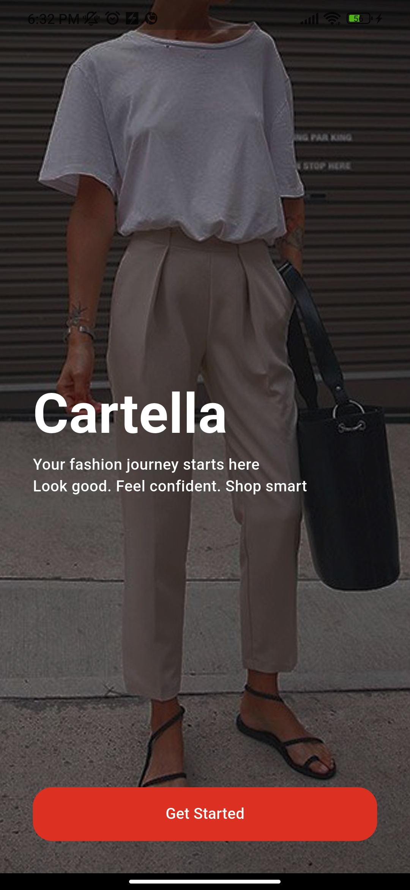
  
  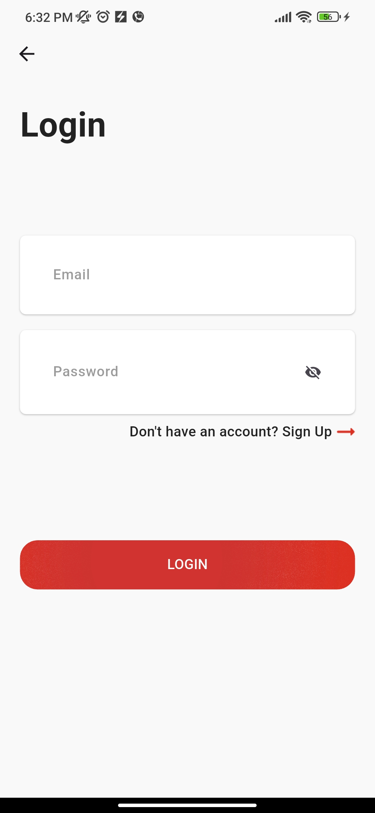
  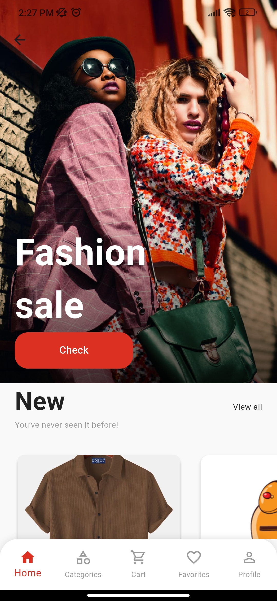
  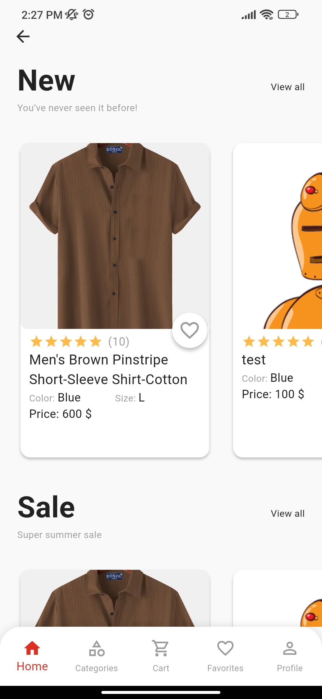
  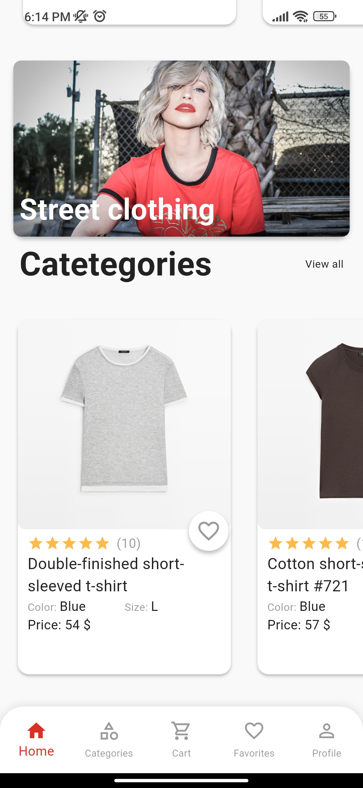
  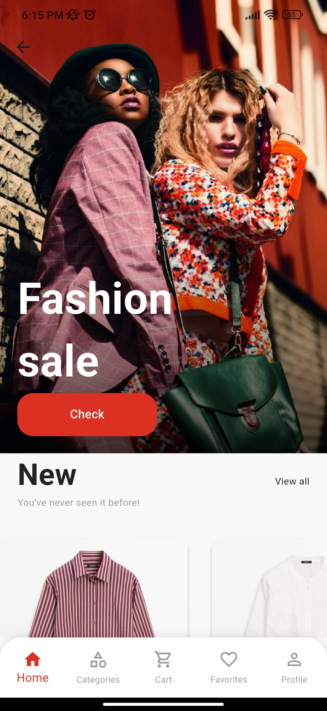
  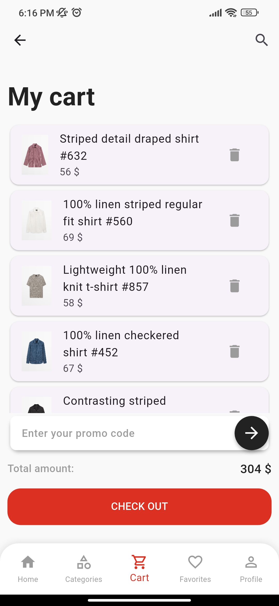
  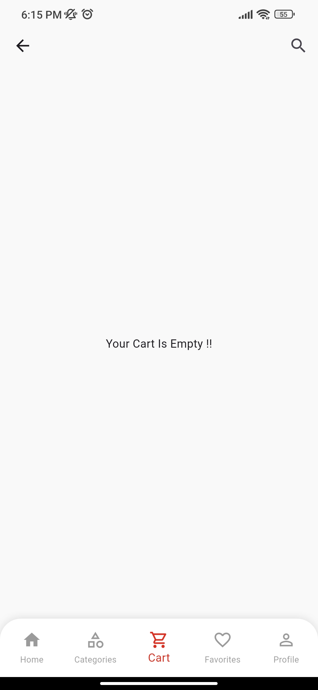
  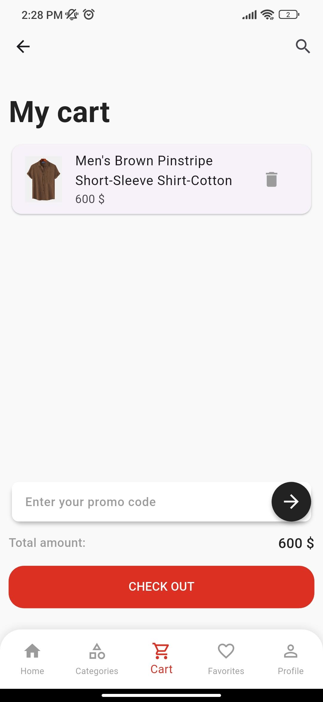
  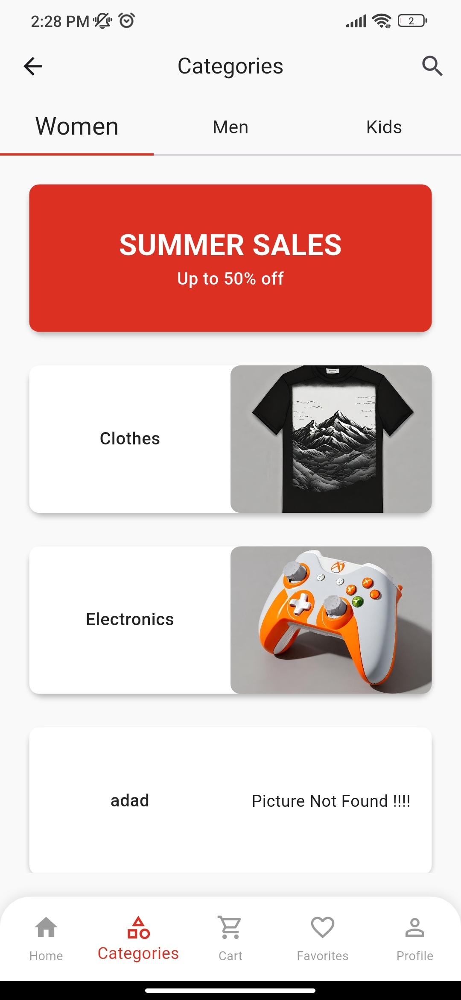
  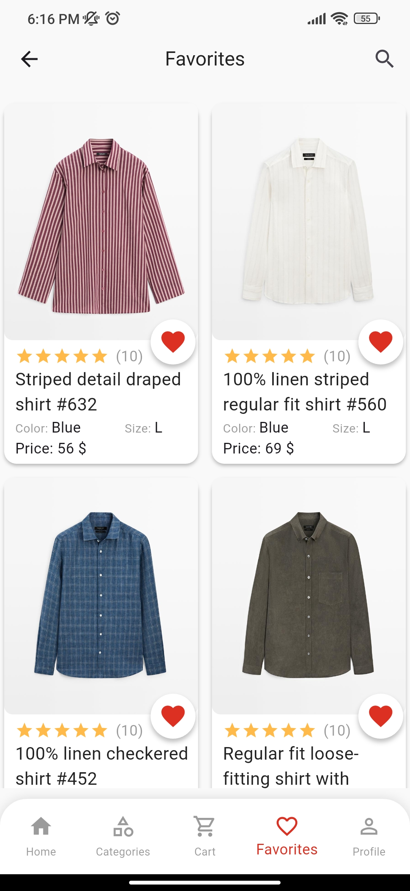
  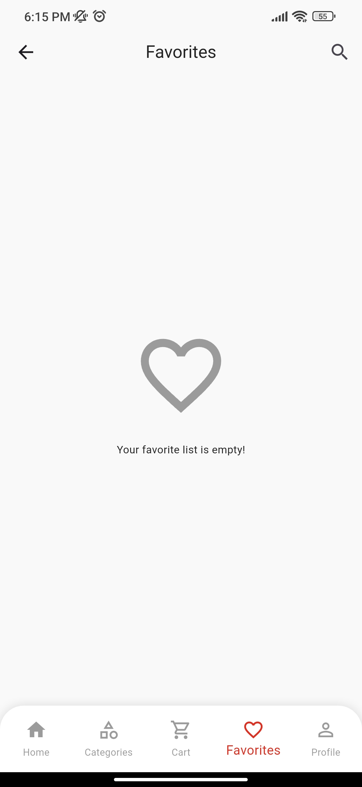
  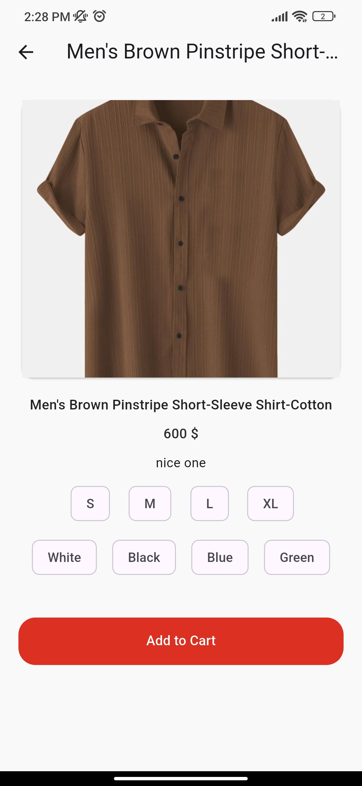
  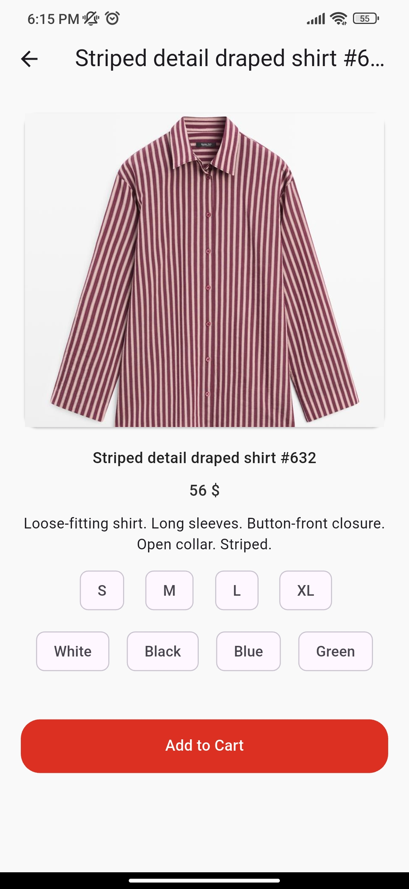
  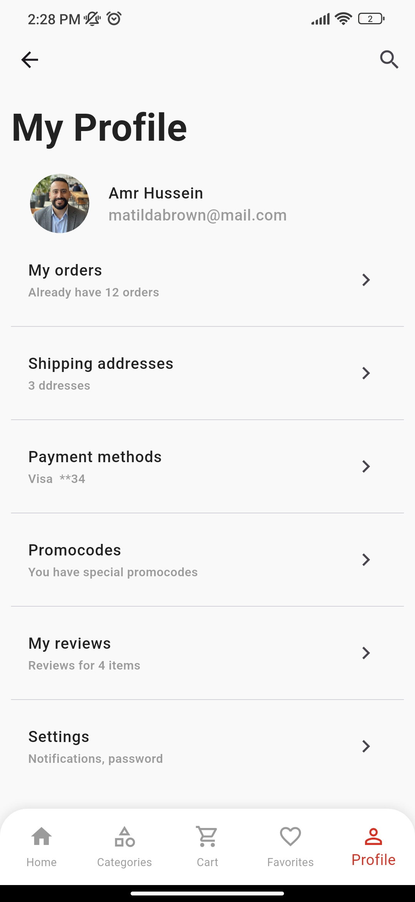
</p>

## 🚀 Features

- User Authentication using Firebase
- Product Categories
- Add to Favorites
- Cart System
- Responsive UI
- State Management using Bloc
- API Integration using Dio & Retrofit


## 🖥️ Tech Stack

- Flutter
- Dart
- Bloc / Cubit
- Dio
- Retrofit
- Firebase
- GetIt (Dependency Injection)

## 🛠️ Architecture

- Feature-Based Structure
- Repository Pattern
- Dependency Injection
- Bloc / Cubit State Management
- API Integration using Dio + Retrofit
- Clean UI Components Reusability

## 📁 Folder Structure

```text
lib/
├── main.dart
├── my_app.dart
├── app_bottom_nav_bar.dart
├── on_boarding_screen.dart
│
├── core/
│   ├── constants/
│   ├── di/
│   ├── helper/
│   ├── networking/
│   ├── routing/
│   ├── theming/
│   └── widgets/
│
└── features/
    ├── auth/
    │   ├── data/
    │   ├── logic/
    │   └── ui/
    ├── home/
    ├── cart/
    ├── favorites/
    ├── categories/
    └── profile/
```

## 🎯 Future Improvements

- Payment Integration
- Dark Mode
- Search Feature
- Admin Dashboard
- Localization

## ⚙️ Installation

```bash
git clone https://github.com/username/cartella.git
cd cartella
flutter pub get
flutter run
```

## 🧍🏻‍♂️ Author

Amr Hussein  
GitHub: https://github.com/amrhusseinsalama
LinkedIn: http://www.linkedin.com/in/amr-hussein-277bba389
Email: amrhusseingohar@gmail.com
